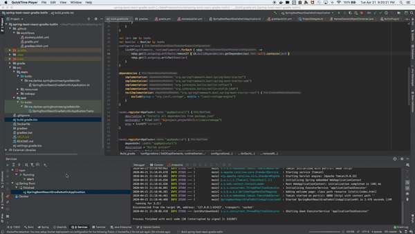

## Using Gradle's Kotlin DSL to Bundle React with a Spring Boot Web Application

This project contains an example of how to serve a React application 
from Spring Boot using Gradle's Kotlin DSL.

## Read the Article

  * [DEV](https://dev.to/darkes/using-gradle-s-kotlin-dsl-to-bundle-react-with-a-spring-boot-web-application-355k)

## How to Connect & Support

  * [Twitter](https://twitter.com/iamdarkes)
  * [LinkedIn](https://www.linkedin.com/in/darkes/)
  * [DEV](https://dev.to/darkes)
  * [Medium](https://medium.com/@darkes)
  * [Instagram](https://www.instagram.com/iamdarkes)
  * [GitHub](https://github.com/iamdarkes)
  * [GitLab](https://gitlab.com/darkes)
  * [darkes.me](https://darkes.me/)
